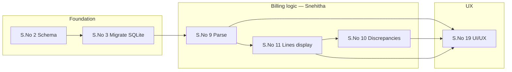
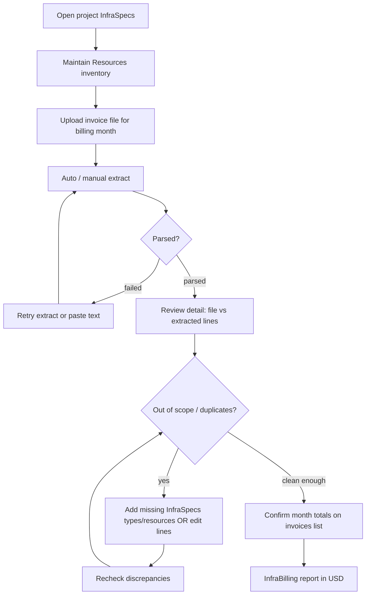

# Spec 11 — Functional Spec: InfraSpecs & InfraBilling Workflow

**Status:** Draft v1 (as-built)
**Depends on:** Spec 01 (Entity Model), Spec 03 (Access Control), Spec 05 (Project CRUD), Spec 08 (Reporting)
**Phase-1 tracker:** Requirements sheet (S.No below) — assignee focus **Snehitha** unless noted

---

## 1. Scope

Per-project **InfraSpecs** (authorized inventory of cloud/SaaS resources) and **billing invoices**
uploaded against that inventory. The system extracts line items from invoice files, compares them
to InfraSpecs, flags discrepancies (especially **out-of-scope** charges), and feeds month/tool
totals into **InfraBilling** reporting (USD).

This is **not** multi-account AWS Cost Explorer: invoices are uploaded as files (PDF/image/text).
Service-level bill lines (e.g. “Amazon Elastic Compute Cloud”) match InfraSpecs by **resource type /
service aliases**, not by linked-account ID.

---

## 1a. Phase-1 requirements → workflow map

Tracker items that drive this workflow. **Bold S.No** = allotted to Snehitha.

| S.No | Requirement (tracker) | Type | Est. | Status (sheet) | Maps to workflow |
|---|---|---|---|---|---|
| **3** | Migrate SQLite → Supabase + migration script verification | Task | 3h | Completed | Foundation for all infra tables / data used in Steps 2–7 |
| **9** | Invoice parsing logic + unit test | Task | 3h | Completed | Step 3–4 extract; Step 5 re-extract / paste-parse |
| **10** | Billing discrepancy detection + unit test | Feature | 6h | Completed | Step 6 OOS / duplicates / amount checks (§5) |
| **11** | Extract & display instance-/service-wise billing (EC2, Lambda, …) + unit test | Enhancement | 3h | Completed | Step 4 line items; Resources types; service aliases in §5 |
| **19** | UI/UX enhancements | Feature | 3h (+2 QA) | In progress | Steps 1–7 chrome: list, detail (PDF + edit/Save), Resources/Billing UX (§7) |

**Upstream / parallel (not Snehitha, but required for the same Phase-1 path)**

| S.No | Requirement | Assignee | Why it matters here |
|---|---|---|---|
| 1 | Provision Supabase instance | Geetashish | Host for schema + auth |
| 2 | Design DB schema + migration validation | Geetashish | `infra_*` tables (migration 0027+) |
| 4 | Validate migrated data integrity | Geetashish | Trust inventory/invoice data before discrepancy QA |
| 5 | Configure Supabase Auth + unit test | Geetashish | Admin / InfraOps / Manager-Lead gates (§2, §6) |
| 6–7 | Deploy to Vercel + env vars | Geetashish | App + storage/extract runtime for uploads |

**Suggested close-out for S.No 19 (still In progress)**

1. Invoice detail: file vs extracted side-by-side; single **Save** for header + lines.
2. Resources + invoices list match project chrome (cards, scroll, pills).
3. Hide empty qty/unit columns; keep amounts single-line.
4. Smoke: upload → extract → OOS badge → edit/Save → recheck → list totals.

---

## 2. Roles & Entry Points

| Role | Access |
|---|---|
| **Admin** | Full InfraSpecs + invoices for any project (`canManageInfra`) |
| **InfraOps** | Same write access; primary home is project InfraSpecs (not PM dashboard) |
| **Manager-Lead** | **View-only** InfraSpecs + invoices for projects they lead |

**Routes**

| Path | Purpose |
|---|---|
| `/projects/{id}/infra` | Project InfraSpecs hub — Resources + Billing invoices list |
| `/projects/{id}/infra/invoices/{invoiceId}` | Invoice detail — file preview + extracted data (edit for Admin/InfraOps) |
| Reports (workbook) | **InfraBilling** sheet — USD pivot by tool / stakeholder / project / month |

---

## 3. Entities (summary)

Aligned with migrations `0026` (InfraOps role) and `0027` (infra tables).

### 3.1 Lookups
- `infra_provider` — billing tool / vendor (AWS, …); soft-deactivated via `is_active`
- `infra_resource_type` (+ optional typed attributes) — e.g. EC2, S3, VPC
- `billing_ownership_option` — stakeholder grouping used in InfraBilling layout

### 3.2 `infra_resource` (InfraSpecs inventory)
| Field | Notes |
|---|---|
| `project_id` | Cascade delete with project |
| `resource_type_id` | Required |
| `name` | Display name |
| `external_id` | Optional cloud/tool ID; unique per project when set |
| `attributes` | JSONB typed extras |

### 3.2a Project billing binding (tool + optional accounts)
- **One billing tool per project** via `project.provider_id` → `infra_provider` (required for InfraSpecs uploads).
- **`project.enforce_billing_accounts`** + allow-list — account restriction for the project.
  - **Off:** tool only; any invoice can be uploaded; no allow-list.
  - **On (or any saved `project_billing_account` rows):** invoices must match allow-listed account numbers or they are **rejected**. Entering account number + name at setup turns restriction on. Matching is trim + case-insensitive on `account_id`; `account_name` is display-only.
- InfraOps/Admin set tool on first InfraSpecs visit (blocking modal). Account restriction toggle is optional there (and editable later). Manager-Lead sees a read-only incomplete banner until the tool is set.
- Uploads are locked to the project tool.
- **Month sheet / InfraBilling:** when a project has multiple allow-listed accounts, amounts are shown in **separate columns per account** (not summed into one monthly total).

### 3.3 `infra_invoice`
| Field | Notes |
|---|---|
| `storage_path` | File in storage bucket |
| `processing_status` | `pending` → `processing` → `parsed` \| `failed` |
| `validation_status` | `unchecked` \| `valid` \| `invalid` \| `partial` |
| `extracted_payload` | JSON (vendor, account_id, invoice_date, …) |
| Header fields | `invoice_number`, `currency`, `amount_total`, billing period, `provider_id` |

### 3.4 `infra_invoice_line`
Description (`line_label`), optional type label, optional qty/unit/unit_cost, `amount`.

### 3.5 `infra_billing_discrepancy`
Types include (non-exhaustive): `out_of_scope_service`, `duplicate_invoice_number`,
`duplicate_period_amount`, `amount_mismatch`, `missing_billing_period`, `missing_line_items`, …
Status: `open` \| `acknowledged` \| `resolved`.

---

## 4. End-to-end ops workflow

### Step 1 — Open InfraSpecs
1. Admin/InfraOps (or Manager-Lead, view-only) opens `/projects/{id}/infra`.
2. Breadcrumb: Projects → {Project} → InfraSpecs (InfraOps may skip project PM detail).
3. **Billing setup gate:** if the project has no tool (`provider_id`), Admin/InfraOps get a blocking setup modal (tool required; optional **Restrict by account** toggle). Manager-Lead sees an incomplete banner only. Resource edit and invoice upload stay disabled until the tool is set.

### Step 2 — Maintain Resources (inventory first)
1. Prefer **adding inventory before** relying on out-of-scope checks.
2. Admin/InfraOps: **Add Resource** / **Edit** / **Delete** (name, service type, ID/ref, typed attrs).
3. Empty inventory ⇒ **every non-zero charge line** is out of scope until matching resources exist.
4. Resource CRUD triggers discrepancy **recheck** for the project’s invoices.

### Step 3 — Upload invoice
1. On Billing section: upload PDF/image/text for the project. Billing tool is **fixed** to the project binding (not free-picked).
2. Upload is blocked if billing setup is incomplete.
3. File stored; invoice row created (`processing_status` starts pending/processing).
4. Extraction runs (auto when configured); list shows status pills (Extracted / failed / OOS / Duplicate / Confirm billing).
5. If **account restriction is on** and account is missing or not on the allow-list: invoice is **rejected** (deleted) with an error reason. If restriction is off, no account check runs.

### Step 4 — Extract & open detail *(S.No 9, 11)*
1. Open invoice → `/projects/{id}/infra/invoices/{invoiceId}`.
2. Left: uploaded file preview (PDF/image) or download link.
3. Right: extracted header + line items (amounts; qty/unit price columns only if present on the bill).
4. Non-USD currencies: show original amounts and USD via FX rates used for reporting
   (`REPORT_CURRENCY` = USD).

### Step 5 — Fix extraction (Admin / InfraOps) *(S.No 9, 19)*
1. **Edit extracted data** → one form for header + all lines.
2. Toolbar: **Cancel** (discard UI edits) or **Save** (persists header + line creates/updates/deletes in one action).
3. Optional: **Re-extract** / **Retry extract**; on hard fail, **Paste invoice text** and parse.
4. **Delete** removes invoice + file (confirm).

### Step 6 — Resolve discrepancies *(S.No 10)*
1. **Out of scope**: charged service/type not represented in InfraSpecs (service-level matching + AWS line aliases, e.g. EC2/S3/VPC labels).
2. Remediation options:
   - Add the missing resource **type** (and instances if needed) under Resources, then **Recheck out-of-scope**; or
   - Correct bad extracted lines on the detail page and Save.
3. **Duplicates**: same invoice number or overlapping period+amount vs another invoice on the project — investigate before treating totals as final.
4. Zero-amount lines are not treated as out-of-scope charges.

### Step 7 — Month summary & reports
1. Invoices list: month summary / FX totals for the project.
2. Reports workbook **InfraBilling** sheet: USD matrix by billing tool, ownership/stakeholder groups, projects, and dynamic months (deduped invoice atoms).

---

## 5. Out-of-scope matching rules (Phase-1)

Deterministic compare only — no invented charges (`lib/infra/discrepancies`). *(S.No 10)*

1. If project has **no** `infra_resource` rows → every non-zero line is out of scope.
2. A line is **in scope** if it matches inventory by:
   - external ID / name appearing in the line label, or
   - resource type label, or
   - **service aliases** from AWS-style line names → InfraSpecs type labels (EC2, S3, RDS, VPC, …).
3. Lines for services with **no** matching type in inventory stay out of scope (e.g. GuardDuty when only EC2/S3 exist).
4. Recheck runs after resource CRUD, invoice extract/edit/save, and manual “Recheck out-of-scope”.

**Known limitation:** consolidated AWS bills spanning multiple linked accounts cannot be split by
account ID in-app today; scope is project inventory + service-type matching only.

---

## 6. Permissions matrix

| Action | Admin | InfraOps | Manager-Lead |
|---|---|---|---|
| View Resources / invoices | ✅ | ✅ | ✅ (own projects) |
| Add / edit / delete resources | ✅ | ✅ | ❌ |
| Upload / delete invoice | ✅ | ✅ | ❌ |
| Extract / re-extract / paste-parse | ✅ | ✅ | ❌ |
| Edit extracted header + lines (Save) | ✅ | ✅ | ❌ |
| Recheck discrepancies | ✅ | ✅ | ❌ |
| See InfraBilling in reports | ✅ | ✅\* | ✅ (scoped) |

\*InfraOps report access follows whatever report entry points that role is given in the app shell.

---

## 7. UI conventions (as-built) *(S.No 19)*

- Section chrome: `rounded-xl` cards, gradient headers (same as Resources / Billing list).
- Invoice list: scrollable cards linking to detail (`Open →`); no inline expand/edit.
- Invoice detail: PDF narrower than extracted panel; line amounts stay single-line (currency in column header).
- Edit mode: compact table for lines (not one card per line); **one Save** for details + lines.

---

## 8. Happy path checklist (ops)

1. [ ] Project exists; user is Admin/InfraOps (or ML viewing).
2. [ ] Resources list includes every billable service type expected on the invoice.
3. [ ] Invoice uploaded for the correct billing period.
4. [ ] Status = Extracted; open detail and spot-check total vs PDF.
5. [ ] Out-of-scope count is zero (or accepted and documented).
6. [ ] No unexpected duplicate pills.
7. [ ] Month/FX totals on list look right; InfraBilling report reflects USD.

**Assignee demo checklist (Snehitha Phase-1)**

1. [ ] S.No 3 — Migrated data visible / scripts verified (with schema from S.No 2).
2. [ ] S.No 9 — Upload + extract succeeds; failed path retry / paste works.
3. [ ] S.No 11 — Line items show service-style charges (EC2, S3, Lambda, …) against inventory.
4. [ ] S.No 10 — OOS / duplicate / amount flags appear and clear after inventory or edit + recheck.
5. [ ] S.No 19 — Detail + list UX match §7; single Save; ready for QA (2h on sheet).

---

## 9. Out of scope for this spec

- Automated pull from AWS Cost Explorer / CUR / multi-account linked-account split.
- Approvals workflow for infra changes (see Spec 10 for PM change approvals only).
- Historical point-in-time inventory vs bill (live inventory vs uploaded invoice only).
- Tracker items owned only by others (S.No 1–2, 4–7) except as dependencies in §1a.
